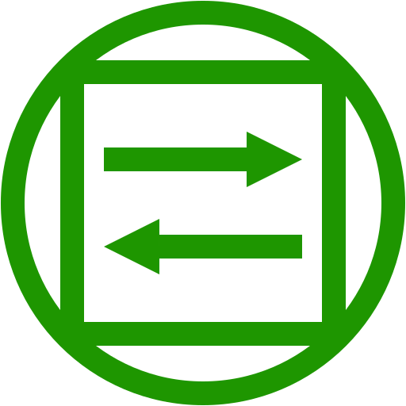

<h1 align="center">
  <br>
  <a href="https://github.com/SteveBlum/circum"></a>
  <br>
  circum
  <br>
</h1>

<<h4 align="center">https://steveblum.github.io/circum/</h4>
<h4 align="center">A simple page which rotates between multiple websites using iframes.</h4>

<p align="center">
  <a href="#key-features">Key Features</a> •
  <a href="#how-to-use">How To Use</a> •
  <a href="#faq">FAQ</a> •
  <a href="#built-with">Built with</a> •
  <a href="#acknowledgments">Acknowledgments</a> •
  <a href="#license">License</a>
</p>


## Key Features

* **Rotating multiple web pages** - Well suited for monitoring or home automation scenarios 
* **Discrete controls** - During operation, all menu buttons and controls are formatted into the content without being distracting
* **Configurable** - All settings can be changed on the fly and are stored in web storage
* **Automatic refresh** - Included iframes are refreshed regularly to keep connections alive

## How To Use

### Using public page

The current stable version of circum is running at https://steveblum.github.io/circum/
Remember that any settings you save in circum are only stored in your browser, so this page is safe to use.
It is however possible to run circum yourself if you prefer a local deployment (see below).

### Using Web server
```bash
# Clone this repository
$ git clone https://github.com/SteveBlum/circum

# Navigate into the repositories directory
$ cd circum

# Install dependencies
$ npm install

# Compile the application
$ npm run build

# Copy the compiled files to your webservers root directory, in this case /var/www
$ cp ./dist/* /var/www/
```

### Using webpack DevServer
Although mostly intended for development, the DevServer will work out-of-the-box without the need to setup a web server:

```bash
# Clone this repository
$ git clone https://github.com/SteveBlum/circum

# Navigate into the repositories directory
$ cd circum

# Install dependencies
$ npm install

# Run the app
$ npm start
```

## FAQ

**Q: What is your intention with circum going forward?**

**A:** Circum is a personal project which I use at home. I am also using it to try out various technologies and tools. Developers therefore may find that it has some overengineered (and some underengineered) parts. That is intentional and reflects my focus of interest. That being said, I am commited to keep circum functional (which is not that hard, its functionally very simple).

**Q: Why is there a clock and a weather page in circum?**

**A:** So it will work without any initial setup, making it easier for new users to understand the concept. It is also useful for testing purposes. The default pages are not intended to be a main feature of circum.

**Q: The default weather page doesn't show any data. Why is this happening?**

**A:** When it is starting, it will use a geolocation request to determine your location. If the request fails, all data will be left blank. This may happen because you or your browser has declined the authorization for the geolocation, or beause you are accessing circum over an unsafe context (http instead of https).

## Built with

<br/>
<br/>


## Acknowledgments

- [Canvas Clock](https://codepen.io/Maku2202/pen/MarRgK/) by Marco Antonio Aguilar Acuña, based on which I developed the default clock page
- [Weather Report](https://bbbootstrap.com/snippets/complete-weather-report-search-bar-32715352/) by Omar Bailkeri, which was my starting point for the default weather report page
- [iframe-carousel](https://github.com/alphafitch/iframe-carousel) by Christoph Fisher, which has a similar functionality as this project
- [bootstrap-carousel](https://github.com/saruba/bootstrap-carousel) by saruba which (if memory serves) was the project which planted the idea for this in my mind
- [Markdownify](https://github.com/amitmerchant1990/electron-markdownify) by Amit Merchant, from which I took the template for this Readme file

## License

GPLv3

---

> GitHub [SteveBlum](https://github.com/SteveBlum)
